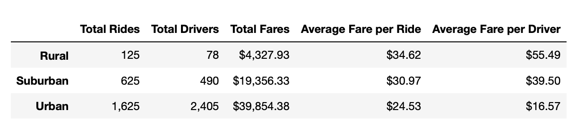
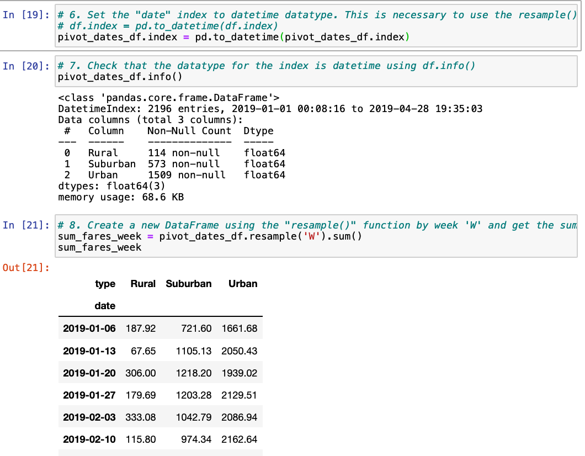
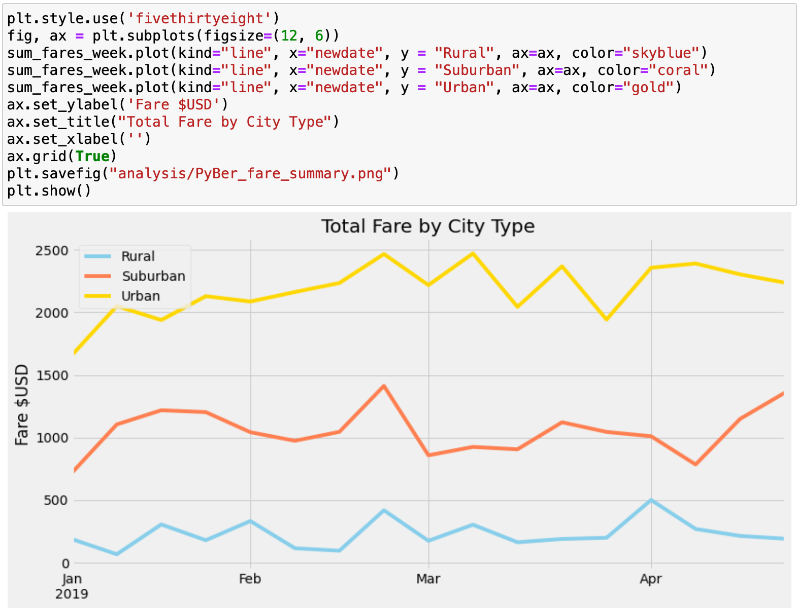

# PyBer Analysis

## Overview of the PyBer Analysis Project
This analysis project was performed to give PyBer Corporation's executive management insight into the weekly fares their service generates across different types of cities. The ride sharing dataset PyBer provided contains valuable information about the differences in the types of cities (Rural, Urban and Suburban city types) where they operate and the fares generated by the drivers in those markets. The dataset contains information on over 2,300 distinct rides given across 120 cities, by over 2,900 drivers. These rides generated over $63,500 in the first four months of 2019. We looked at the data and wrote Python code to summarize the amount of rides given, the quantiity of drivers and the fares generated (in total, and also average fares per ride and per driver) across the 3 distinct types of cities. We also plotted a graph of the fares generated each week during the period analyzed for the 3 types of cities.

### Resources
Data sources provided:  
* city_data.csv 
* ride_data.csv

Software utilized: 

* Python Version 3.8.3 
* Jupyter Notebooks 6.03
* Anaconda 4.8.4
* Visual Studio Code Version: 1.47.3

## Results

### Summary data on Rides, Drivers and Fares across Rural, Suburban and Urban cities

Our analysis showed the differences in number of rides, number of drivers and fares generated across the different city types. The Urban city type generated the most revenue for the period analyzed, bringing in $39,854. Urban cities also had the most drivers (2,405 out of a total 2,973 drivers) who gave the highest number of rides (1,625 out of 2,375 total rides). On average however, Urban cities generated the lowest average fares per ride and per driver ($24.53 and $16.57, respectively) than the other city types.

Suburban cities had the seond highest number of rides given and drivers working in those markets, and generated the second highest total fares. The average fare per ride and average fare per driver in Suburban markets ($30.97 and $39.50, respectively) were higher than those for Urban cities, but lower than those for Rural cities.

Rural cities had the lowest number of driver and total rides given, as well as generating the lowest amount of fares for the period. However, Rural cities had the highest average fare per ride and average fare per driver compared to Urban and Suburban cities. The average fare per ride in Rural cities was $10 higher than the average for Urban cities. The average fare per driver in Rural cities was almost 3 times higher than the average fare per driver in Urban cities. This average fare per driver was also more than 40% higher than the average for Suburban cities.

### Visualization of weekly Fares by City Type

We used the datasets provided to extract the values of the fares generated for each ride and used Python's 'groupby' and 'sum' functions to categorize the fares by the type of city where they were generated, and then the 'pivot' method to build DataFrames to be used in a visualization.

Using Pandas' 'datetime' and 'resample' functions, we created a DataFrame containing the dates rides were given with the associated fares generated by drivers in each  type of city.

This provided us all of the data needed to plot line graphs of the fare revenue generated each week during the period sampled.

## Summary

Finally, you’ll submit a written report that summarizes how the data differs by city type and how those differences can be used by decision-makers at PyBer.
There is a description of the differences in the ride-sharing data for ALL SIX metrics by city type
* Recommendation 1 for CEO for addressing any disparities among city types
* Recommendation 2 maybe incentivize more Rural drivers to work in Rural cities
* Recommendation 3 maybe disincentize Urban drivers from working in Urban cities and driving in Suburban or Rural cities, so that average fares per ride and driver move higher in Urban markets and these Urban drivers can earn higher average fares in more lucrative markets
There is a statement summarizing three business recommendations to the CEO for addressing any disparities among the city types. (4 pt)