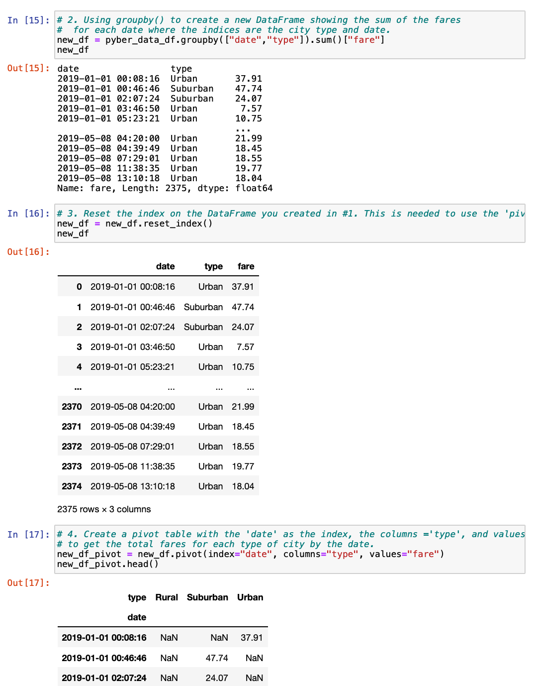

# PyBer Analysis

## Overview of the PyBer Analysis Project
This analysis project was performed to give PyBer Corporation's executive management insight into the weekly fares their service generates across different types of cities. The ride sharing dataset PyBer provided contains valuable information about the differences in the types of cities (Rural, Urban and Suburban city types) where they operate and the fares generated by the drivers in those markets. The dataset contains information on over 2,300 distinct rides given across 120 cities, by over 2,900 drivers. These rides generated over $63,500 in the first four months of 2019. We looked at the data and wrote Python code to summarize the amount of rides given, the quantity of drivers and the fares generated (in total, and also average fares per ride and per driver) across the 3 distinct types of cities. We also plotted a graph of the fares generated each week during the period analyzed for the 3 types of cities.

### Resources
Data sources provided:  
* city_data.csv 
* ride_data.csv

Software utilized: 

* Python Version 3.8.3 
* Jupyter Notebooks 6.03
* Anaconda 4.8.4
* Visual Studio Code Version: 1.47.3

## Results

### Summary data on Rides, Drivers and Fares across Rural, Suburban and Urban cities

Our analysis showed the differences in number of rides, number of drivers and fares generated across the different city types. The Urban city type generated the most revenue for the period analyzed, bringing in $39,854. Urban cities also had the most drivers (2,405 out of a total 2,973 drivers) who gave the highest number of rides (1,625 out of 2,375 total rides). On average however, Urban cities generated the lowest average fares per ride and per driver ($24.53 and $16.57, respectively) than the other city types.

#### Pyber Summary DataFrame :

Suburban cities had the second highest number of rides given and drivers working in those markets, and generated the second highest total fares. The average fare per ride and average fare per driver in Suburban markets ($30.97 and $39.50, respectively) were higher than those for Urban cities, but lower than those for Rural cities.

Rural cities had the lowest number of driver and total rides given, as well as generating the lowest amount of fares for the period. However, Rural cities had the highest average fare per ride and average fare per driver compared to Urban and Suburban cities. The average fare per ride in Rural cities was $10 higher than the average for Urban cities. The average fare per driver in Rural cities was almost 3 times higher than the average fare per driver in Urban cities. This average fare per driver was also more than 40% higher than the average for Suburban cities.

### Visualization of weekly Fares by City Type

We used the datasets provided to extract the values of the fares generated for each ride and used Python's 'groupby' and 'sum' functions to categorize the fares by the type of city where they were generated, and then the 'pivot' method to build DataFrames to be used in a visualization.

#### Python code grouping data by date and city type and aggregating fares:

Using Pandas' 'datetime' and 'resample' functions, we created a DataFrame containing the dates rides were given with the associated fares generated by drivers in each  type of city.

#### Python code making a datetime object and resampling the data into weekly fare bins:

This provided us all of the data needed to plot line graphs of the fare revenue generated each week during the period sampled. After putting the graph together we formatted it and can see the weekly Fare revenue generated by PyBer across the 3 city types for the first four months of 2019.

#### Code used to format and show the line graph of Total Fares by City Type:

## Summary
The dataset shows that for the timeframe analyzed, there are very interesting differences between the markets, as measured by the type of city- Urban, Suburban or Rural:
* Most of PyBer's Fare revenue came from Urban city types, and this market also has the highest number of Drivers who gave the biggest proportion of total Rides-   
    * however the Urban market has the **lowest** Average Fare per Driver and Average Fare per Ride of any city type.

* Suburban city types had the second largest total Fare revenue generated for the period, and also has the second highest number of Rides given and second highest number of Drivers. The Average Fare per Ride and Driver was in the middle, below those for Rural city types but higher than Urban city types.

* Rural city types had the lowest total Fare revenue generated as well as the lowest number of Rides given and the lowest number of Drivers. The Average Fare per Ride and per Driver was the highest of any city type. 

The graph plotting the weekly Fare revenue by type of city shows that Urban markets bring in the most Fare revenue by far of the any of the 3 city types:
* Urban city types generate about twice the Fare revenue that Suburban markets do, and about 9 times the Fare revenue that Urban market bring in. 

* While weekly Fare revenue moves higher and lower from week to week, more or less together across the 3 market types there do not seem to be any cyclical patterns, but the time frame analyzed may be too short to pick up any interesting trends.

### Recommendations

* Since the drivers giving rides in Urban city types generate the bulk of total Fare revenue (about 60%) the company should maintain their main focus on this market, and work to increase their marketshare while taking care of their Urban drivers.

* Consider spending advertising and marketing dollars to attract more new drivers to the Rural markets, this could be a strategy to increase overall revenue from the city type that has the highest Fare per ride and driver rates across all markets. This may be the best return on investment of marketing budget as having more drivers in Rural areas may give PyBer a better chance of capturing more of the higher Fares and grow their market share in this relatively more lucrative city type. 

* Another strategy that could increase revenue could be to incentivize Urban drivers to venture out to drive in the Suburbs around the Urban areas where they normally operate, as having more drivers in the relatively more lucrative city type (compared to Urban city types) could also raise overall Fare revenue and market share and possibly offset the cost of potential incentives used. 

